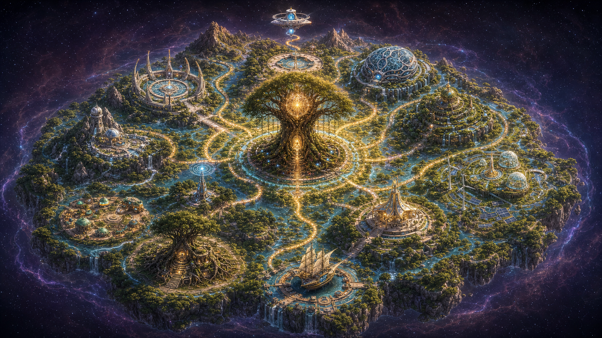
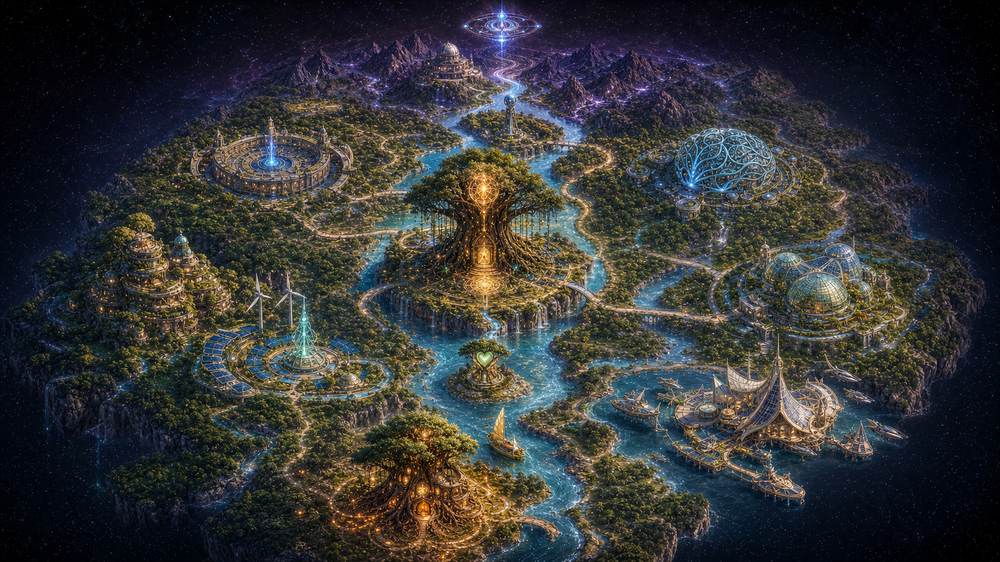
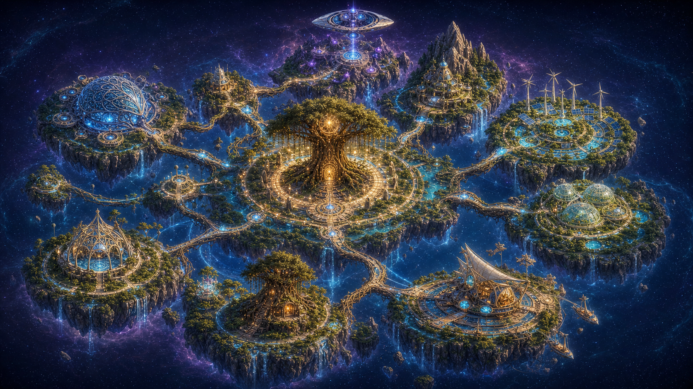

# One Emergence Map — Composition Studies

Generated with the built-in image generation tool on 2026-07-27. The two user
images were used as mood, symbol, and content references; none of these studies
is an edit of the originals.

These files are **design references**, not production assets. They deliberately
remain outside `public/`.

## A — Radial Sanctuary



Best at:

- immediate readability;
- making the Tree of Emergence the unquestioned center;
- clear RTS-style districts and short connection paths.

Risk: the radial order can feel more like a designed diagram than a living
geography.

## B — River of Emergence



Best at:

- translating the seven-stage journey into a natural south-to-north route;
- creating distinct warm, living, and cosmic depth zones;
- making exploration feel like travel through one coherent land.

Risk: the full personal sequence needs careful spacing so all seven landmarks
remain individually legible.

## C — Constellation Archipelago



Best at:

- expressing a network of sovereign but connected centers;
- giving every major institution its own clear silhouette;
- visually joining cosmic and solarpunk language.

Risk: bridges and separated islands can make the world feel less inhabited and
more like a level-select screen.

## Selected direction

**B — River of Emergence was selected on 2026-07-27.** It is the geographic
foundation, with A's stronger central-tree scale and C's clearly separated
institutional silhouettes.

The production plan calls for one targeted synthesis draft with:

- the continuous river-valley landmass from B;
- the central tree enlarged by roughly 20%;
- all seven personal landmarks visibly present along one uninterrupted route;
- simpler global-center silhouettes with more empty hotspot space;
- no baked-in energy lines, labels, or UI.

## Prompt set

All variants shared this production framing:

```text
Use case: stylized-concept
Asset type: early composition concept for the One Emergence website world map
Input images: the first reference supplies mood and symbolic vocabulary; the
second supplies the seven personal chakra landmarks. Generate a new original
scene, not an edit or copy.
Style/medium: painterly cinematic game environment concept art, premium modern
RTS key art, sophisticated solarpunk mysticism, organic architecture integrated
with living terrain.
Composition/framing: wide 16:9 full-map composition, true isometric bird's-eye
view around 35 degrees, no horizon or sky band; generous separation around all
fifteen landmarks for future clickable hotspots.
Lighting/mood: warm gold at the living center, cyan infrastructure, violet
cosmic height, deep-space void outside the land; hopeful, inhabited,
non-militaristic.
Materials/textures: living wood, stone, glass, greenery, water, subtle sacred
geometry, restrained futuristic detail.
Constraints: no text, letters, labels, logos, watermark, interface, borders,
armies, weapons, dystopia, duplicated buildings, or inconsistent camera angles.
```

Variant-specific composition prompts:

```text
A — Radial Sanctuary
A coherent island continent radiates from an enormous Tree of Emergence at the
exact center. Seven global centers occupy distinct radial districts. A second
spiral route contains the seven personal landmarks from Root Home in the south
to a hovering Cosmic Control Center in the north.

B — River of Emergence
A long living river valley flows from Root Home in the warm south toward a
mountain observatory and hovering Cosmic Control Center in the north. The Tree
of Emergence grows on a central river island; side valleys hold the seven global
centers. The composition is asymmetric and geographic rather than radial.

C — Constellation Archipelago
Seven substantial floating bioregion islands surround a large central Tree of
Emergence island. Living root bridges, waterways, and energy lines connect the
institutions; the seven-stage personal route crosses the archipelago.
```
