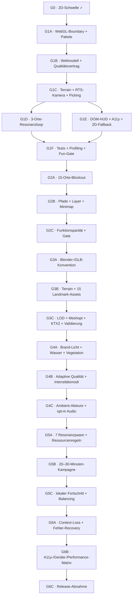

# One Emergence 3D — Ausführungsgraph

Status: am 27. Juli 2026 vollständig abgeschlossen  
Ziel: Ende von Gate 5 der
[3D-Roadmap](./2026-07-27-one-emergence-immersive-3d-roadmap.md), inklusive
Release-Härtung.

## Produktthese

Die Welt ist eine friedliche Echtzeitstrategie über Aufmerksamkeit und
Resonanz. Die prägende Interaktion ist ein sichtbarer Lichtstrom, der vom Tree
of Emergence durch die Landschaft zu einem persönlichen Ort und seinem
globalen Center fließt. Die ruhige DOM-Oberfläche erklärt nur, was die Welt
nicht selbst zeigen kann.

## Abhängigkeitsgraph

## Arbeitsregeln

- Ein Knoten beginnt erst, wenn seine eingehenden Kanten erfüllt sind.
- Jeder nicht-triviale Knoten endet mit einem ausführbaren Test oder messbaren
  Budget.
- `/map` darf niemals Three.js, R3F oder 3D-Assets laden.
- Still-Modus und fehlendes WebGL erhalten die vollständige 2D-Karte.
- Canvas visualisiert; Auswahl, Inhalte und Kernaktionen bleiben auch im DOM
  bedienbar.
- Keine Physics-, ECS-, Multiplayer-, Postprocessing- oder Audio-Dependency,
  bevor ein gemessener Bedarf besteht.
- Keine finalen 15 Gebäude, bevor der 3-Orte-Loop das Fun-Gate passiert.

## Aktuelle Front: Release abgeschlossen

| Knoten | Ergebnis                                                                                 | Abnahme                                | Status |
| ------ | ---------------------------------------------------------------------------------------- | -------------------------------------- | ------ |
| G1A    | kleine Client-Boundary; Three/R3F nur auf `/map/immersive`                               | Build grün; `/map` ohne 3D-Requests    | fertig |
| G1B    | typisierte Platzierungen, Qualitätsstufe, WebGL-/Still-Entscheidung                      | Unit-/Browser-Check                    | fertig |
| G1C    | prozedurales Terrain, Tree, Root Home, Living Earth Institute, orthografische RTS-Kamera | Maus, Touch und Tastatur               | fertig |
| G1D    | deterministischer Resonanzstrom mit mindestens einer Entscheidung                        | Loop abschließbar und zurücksetzbar    | fertig |
| G1E    | leises DOM-HUD, Auswahlparität, Fallback und Fokusführung                                | WCAG-AA-Baseline                       | fertig |
| G1F    | Playwright, Bundle-/Frame-Messung, visuelle QA                                           | Fun-Gate dokumentiert                  | fertig |
| G2A    | alle 15 Orte als typisierte 3D-Blockouts                                                 | Auswahl und Überblick                  | fertig |
| G2B    | Pfade, Layer und Übersichtsnavigation                                                    | Maus, Touch und Tastatur               | fertig |
| G2C    | Funktionsparität zur 2D-Karte                                                            | Desktop-/Mobile-Gate                   | fertig |
| G3A    | Blender-/GLB-Konvention und ausführbare Asset-Prüfung                                    | reproduzierbarer Exportvertrag         | fertig |
| G3B    | Terrain- und Landmark-Assets mit gemeinsamem Materialsystem                              | Referenzkamera und Größenbudget        | fertig |
| G3C    | LOD, Kompression und Produktionsvalidierung                                              | Asset-/Build-Gate                      | fertig |
| G4A    | Brand-Licht, Wasser und sparsame Vegetationsbewegung                                     | lesbarer lebender Weltzustand          | fertig |
| G4B    | adaptive Qualität und Intensitätsmodi                                                    | stabile Frame-/Speicherbudgets         | fertig |
| G4C    | wenige Ambient-Akteure und opt-in Soundscape                                             | keine Autoplay-/Still-Regression       | fertig |
| G5A    | sieben Resonanzpaare und geteilte Aufmerksamkeit                                         | deterministische Ressourcenregeln      | fertig |
| G5B    | vollständige Emergence-Kampagne                                                          | zwei erfolgreiche Strategien           | fertig |
| G5C    | lokale Fortsetzung und Balancing                                                         | 20–30-Minuten-Simulation               | fertig |
| G6A    | Context-Loss und Fehler-Recovery                                                         | Fortschritt und Fokus bleiben erhalten | fertig |
| G6B    | A11y-, Geräte- und Performance-Matrix                                                    | Budgets und Rückfallebenen grün        | fertig |
| G6C    | Produktionsbuild, visuelle QA und Release-Abnahme                                        | vollständiges Nachweisprotokoll        | fertig |

## Gate-1-Designvertrag

- **Subjekt:** ein lebendes strategisches Heiligtum, kein Militärspiel.
- **Kamera:** orthografische 48°-Vogelperspektive; Pan und Zoom sind begrenzt.
- **Drei Tiefen:** warme Wurzelzone, solarpunk-lebendige Mitte, kosmischer
  Horizont.
- **Signatur:** ein gold-cyaner Resonanzstrom reagiert sichtbar auf die
  Entscheidung der spielenden Person.
- **UI:** Welt im Zentrum, Aktionen an den Rändern, keine Dashboard-Kartenwand.
- **Motion:** Kamera = Flow, Resonanz = Sacred, erster Emergence-Abschluss =
  Event; Still bleibt vollständig statisch.

## Nachweisprotokoll

Dieser Abschnitt wird pro abgeschlossenem Knoten ergänzt.

- G0: `/map` → „Eintauchen“ → `/map/immersive`; Produktionsbuild und fünf
  fokussierte Playwright-Tests grün.
- G1A–G1B: Three `0.185.1`, R3F `9.6.1` und Drei `10.7.7` liegen hinter
  `next/dynamic(..., { ssr: false })`; der identifizierte 3D-Chunk wurde auf
  `/map` nicht, auf `/map/immersive` dagegen geladen.
- G1C–G1E: Tree of Emergence, Root Home und Living Earth Institute stehen auf
  prozeduralem Terrain mit Flussbett, orthografischer begrenzter RTS-Kamera,
  Canvas-Picking und vollständiger DOM-Bedienung. Still, fehlendes WebGL,
  manueller 2D-Wechsel und Context-Loss nutzen die 2D-Karte; der
  Resonanzfortschritt und die Fokusführung bleiben erhalten.
- G1F: Produktionsbuild, TypeScript und ESLint grün; 24/24 fokussierte
  Desktop-/Mobile-Smoke-Checks und 2/2 WCAG-2.2-Axe-Checks bestanden. Gemessen
  wurden 60,3 FPS bei 1280×720, 59,9 FPS im 390×844-Profil, LCP 636 ms und
  CLS 0. Der erste Impeccable-Critique-Snapshot liegt unter
  `.impeccable/critique/` (29/40 vor dem abgeschlossenen P1-Polish).
- G2A–G2C: Alle 15 Landmarken besitzen typisierte Weltkoordinaten, eigene
  prozedurale Silhouetten, Pick-Proxies und Zustandslicht. Cyan-Speichen und
  der violette Journey-Pfad machen die drei Tiefen lesbar; Weltatlas und
  Minimap bieten vollständige DOM-Navigation. TypeScript, ESLint,
  14/14 Chromium-Smokes, 9/9 Mobile-Map-Smokes und 2/2 Axe-Checks sind grün.
  Das rohe erste Szenenpaket aus 3D-Chunks und Masterkarte misst rund 4,36 MB
  und bleibt damit unter dem 6-MB-Planungsbudget.
- G3A–G3C: Die 15 produktiven Landmark-Assets bleiben überwiegend
  prozedural, tokenbasiert und in drei echten Geometrie-LODs. Ein
  Higgsfield-Hero-Proof für den Tree wurde aus einem neu erzeugten
  Referenzbild rekonstruiert: Das 7,43-MB-Rohmodell fiel durch, der
  validierte Meshopt/WebP-Export misst 857 KB bei 30.487 Dreiecken und wird
  ausschließlich in High lazy geladen. `pnpm test:world-assets`,
  Produktionsbuild und der High-LOD-Browsercheck sind grün; der vollständige
  Vertrag liegt unter `docs/design/world-map-3d-asset-contract.md`.
- G4A–G4C: Drei wechselbare Brand-Atmosphären, lebende Flussmotive,
  shaderbewegte instanzierte Vegetation und drei Ambient-Akteure machen den
  Weltzustand lesbar. Drei Qualitätsstufen werden über die echte Framerate
  automatisch abgesenkt; Still und ruhige Zustände rendern nur bei Bedarf.
  Die native Web-Audio-Klangwelt startet erst nach einem bewussten Klick,
  pausiert in verborgenen Tabs und benötigt keine neue Abhängigkeit.
  Produktionsbuild, 20/20 ausgeführte Desktop-/Mobile-Map-Smokes und 2/2
  Axe-Checks sind grün; zwei Desktop-only Verträge wurden mobil planmäßig
  übersprungen.
- G5A–G5C: Sieben feste Resonanzpaare teilen fünf Aufmerksamkeitspunkte mit
  einer Kapazität von zwei pro Ort. Der Unterstützungsring, reversible
  Dissonanz und der verlustfreie Emergence-Zustand sind deterministisch.
  Zwei reproduzierbare Strategien erreichen Emergence nach 478 Pulsen
  (19:55 Minuten) beziehungsweise 558 Pulsen (23:15 Minuten). Jede
  Umverteilung verändert Lichtstrom, Flussenergie und Landmark-Zustand
  unmittelbar. Eine semantisch validierte v2-Session setzt lokal fort;
  korrupte, alte oder unmögliche Abschlussstände fallen sicher auf einen
  sauberen Start zurück.
- G6A–G6C: Echter WebGL-Kontextverlust, fehlendes WebGL 2, Still,
  `prefers-reduced-motion`, schwache Geräte, Tastatur, Touch, Atlas-Fokus,
  Reload und Reset sind im Produktionsbuild geprüft. Die finale
  Desktop-/Mobile-Map-Matrix besteht mit 29 ausgeführten Checks und neun
  absichtlichen gerätespezifischen Skips; 14/14 Domain-, Geometrie- und
  Platzierungschecks, 32/32 ausgeführte Axe-Checks und 18/18
  Web-Vitals-/Lazy-Loading-Checks sind grün.
- G6-Performance: Das erste Medium-/Low-Szenenpaket überträgt 690.389 Bytes.
  Eine aktive Referenzszene misst Low 190 Draw Calls / 36.476 Dreiecke /
  190 Geometrien / 1 Textur, Medium 327 / 52.338 / 213 / 3 und High
  259 / 120.398 / 177 / 4; alle drei Stufen melden `budget=pass`. Das
  Higgsfield-Tree-GLB bleibt mit 857.436 Bytes und 30.487 Dreiecken separat
  und High-only lazy. Der sichtbare QA-Browser ist auf 30 Hz begrenzt und
  rendert die Szene mit 30,36 FPS gegenüber 30,06 FPS ohne Canvas; die
  schwankende SwiftShader-CI-Kadenz wird deshalb nur protokolliert und nicht
  als Hardware-Gate missbraucht.
- Release: TypeScript, ESLint, Produktionsbuild und
  `pnpm test:world-assets` sind grün. Das optionale Onboarding bleibt
  ponytail-konform kontextuell im vorhandenen HUD; ein separates
  Tour-Framework ist ohne beobachteten Usability-Bedarf nicht Teil des
  Releases.
